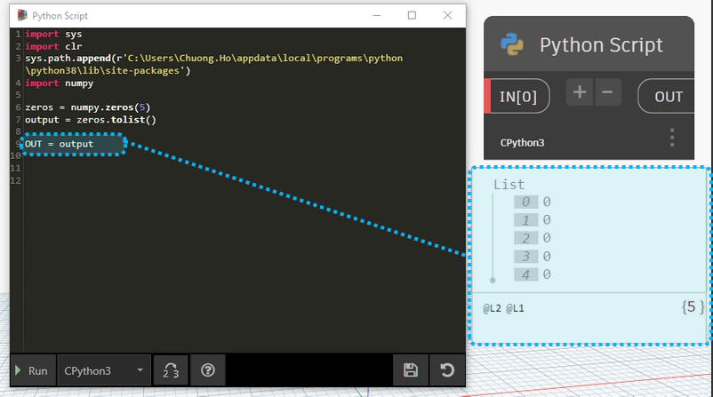

# Numpy

[NumPy](https://numpy.org/) is a library for the Python programming language, adding support for large, multidimensional arrays and matrices, along with a large collection of high-level mathematical functions to operate on these arrays.

```{figure} ../images/ML/numpy.png
---
height: 250px
name: directive-fig
---

```


# Install

Use command to install library. Because I am using a lot of python versions on my machine to work( 3.8.3, 3.9.6, 3.10 ), so I will use this command to install Numpy correctly with working version of python.In this example, I using python `3.8`.

```bash
py -3.8 -m pip install numpy
```

```{note}
If on your machine this is installing python for the first time and using only one version, use the shortened command below to install NumPy. They are similar to the above command.
``` bash
pip install numpy

```
Check folder path installed by command in `Windows PowerShell`

```bash
python
import sys
sys.path[5]
```

```{figure} ../images/ML/sitepackage.png
---
height: 250px
name: directive-fig
---
Check Path Installed Package Python
```
Finally, you should make sure all functions and Numpy have installed successfully.

```{figure} ../images/ML/nympyinstalled.png
---
height: 500px
name: directive-fig
---
Numpy Package Installed
```

# Start with Numpy

Replace path lib with path in your computer before run script.

```py
import numpy as np
zeros = np.zeros(5)
zeros.tolist()
```
In [Dynamo](https://dynamobim.org/) scripts, you need to set `OUT` to see output

```py
import sys
import os
#import System
#path_local = System.Environment.GetFolderPath(System.Environment.SpecialFolder.LocalApplicationData)
sys.path.append(r'C:\Users\Chuong.Ho\appdata\local\programs\python\python38\lib\site-packages')
import numpy as np
zeros = np.zeros(5)
OUT = zeros.tolist()
```
`Result:`
```{toggle}

```
`Download:`

```{button-link} https://github.com/chuongmep/Awesome-Dynamo/blob/master/files/demonumpy.dyn
:color: primary
:shadow:
```
