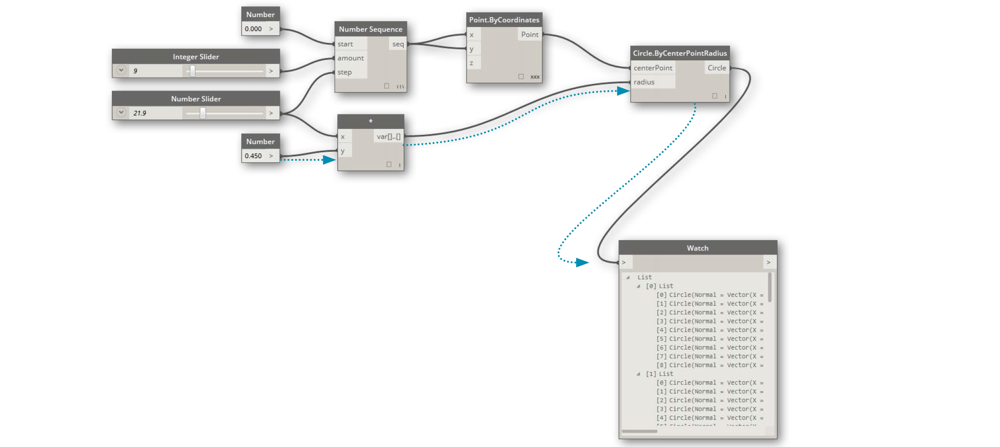

# Dynamo  Main Page
## Dynamo Primer

An introductory resource for beginners and a long-term reference. See this structured explanation of everything from data management to computational geometry and working with Revit.

[Learn - Dynamo BIM](https://primer2.dynamobim.org/)

Dynamo GitHub: [https://github.com/DynamoDS/Dynamo](https://github.com/DynamoDS/Dynamo)

Dynamo Builds: [https://dynamobuilds.com/](https://dynamobuilds.com/)

What Is New In Dynamo : [https://github.com/DynamoDS/Dynamo/wiki/Release-Notes](https://github.com/DynamoDS/Dynamo/wiki/Release-Notes#212)

## Dynamo Page Related

- The Building Coder: [https://thebuildingcoder.typepad.com/](https://thebuildingcoder.typepad.com/)
- Autodesk University: [https://www.autodesk.com/autodesk-university/](https://www.autodesk.com/autodesk-university/)
- BIM 42: [https://www.bim42.com/](https://www.bim42.com/)
- John Pierson: [https://www.sixtysecondrevit.com/](https://www.sixtysecondrevit.com/)
- Archi Lab.net: [https://archi-lab.net/category/dynamo/](https://archi-lab.net/category/dynamo/)
- Orchid: [https://erfajo.blogspot.com/2019/](https://erfajo.blogspot.com/2019/)
- c.poupin : [https://voltadynabim.blogspot.com/](https://voltadynabim.blogspot.com/)
- Teocomi : [https://teocomi.com/](https://teocomi.com/)
- Dynamo Nodes : [https://dynamonodes.com/](https://dynamonodes.com/)
- DynamoScripts: [https://dynamoscripts.com/blog/](https://dynamoscripts.com/blog/)
- T[wenty-two](https://twentytwo.space/).space: [https://twentytwo.space/](https://twentytwo.space/)
- Lubim : [http://lubim.co/blog/](http://lubim.co/blog/)
- Puntorevit: [https://puntorevit.blogspot.com/](https://puntorevit.blogspot.com/)
- Paolo Emilio Serra : [https://puntorevit.blogspot.com/](https://puntorevit.blogspot.com/)
- Plevit1: [https://plevit1.blogspot.com/](https://plevit1.blogspot.com/)
- Vashaug : [https://vasshaug.net/](https://vasshaug.net/)
- SimplyDynamo:  [https://simplydynamo.blogspot.com/](https://simplydynamo.blogspot.com/)
- Revit Dyanmo API : [https://revitdynamoapi.blogspot.com/](https://revitdynamoapi.blogspot.com/)
- The Revit saver : [https://therevitsaver.blogspot.com/2015](https://therevitsaver.blogspot.com/2015)
- RevitPure: [https://revitpure.com/blog/tag/Dynamo](https://revitpure.com/blog/tag/Dynamo)
- diydynamo:  [http://www.diydynamo.com/](http://www.diydynamo.com/)
- Revit Experiments: [https://revitexperiments.blogspot.com/](https://revitexperiments.blogspot.com/)
- Parametricmonkey: [https://parametricmonkey.com/](https://parametricmonkey.com/)
- Revisit Add-ons : [https://revitaddons.blogspot.com/](https://revitaddons.blogspot.com/)
- Martinportfolio:  [http://www.martinportfolio.com/blog/](http://www.martinportfolio.com/blog/)
- AECmag : [https://aecmag.com/](https://aecmag.com/)
- Landarchbim: [https://landarchbim.com/blog/all-dynamo-posts/](https://landarchbim.com/blog/all-dynamo-posts/)
- Ikleerbim: [https://ikleerbim.blogspot.com/](https://ikleerbim.blogspot.com/)
- BIM Planet : [https://bimplanet.org/](https://bimplanet.org/)
- Блог Вадима Муратова: [https://zen.yandex.ru/muratovbim](https://zen.yandex.ru/muratovbim)
- BIM-me-up : [https://bim-me-up.com/tag/blog/](https://bim-me-up.com/tag/blog/)
- BIMregime: [https://bimregime.wordpress.com/blog-2/](https://bimregime.wordpress.com/blog-2/)
- Evolve lab : [https://www.evolvelab.io/](https://www.evolvelab.io/)
- Weeklydynamo: [https://weeklydynamo.blogspot.com/](https://weeklydynamo.blogspot.com/)
- Revitnamo: [https://revitnamo.wordpress.com/](https://revitnamo.wordpress.com/)
- **Martinporfolio**: [http://www.martinportfolio.com/#/dynamo/](http://www.martinportfolio.com/#/dynamo/)
- Revitstructureblog : [https://revitstructureblog.wordpress.com/](https://revitstructureblog.wordpress.com/)
- The Revit Complex: [https://therevitcomplex.blogspot.com/](https://therevitcomplex.blogspot.com/)
- Revitbeyoundbim: [https://revitbeyondbim.wordpress.com/](https://revitbeyondbim.wordpress.com/)
- Badmonkeys: [http://www.badmonkeys.net/](http://www.badmonkeys.net/)
- Modelical : [https://www.modelical.com/en/modelical-package-for-dynamo/](https://www.modelical.com/en/modelical-package-for-dynamo/)
- Sastrugi: [https://sites.google.com/view/sastrugi](https://sites.google.com/view/sastrugi)
- Data-Shapes : [https://data-shapes.io/tag/dynamo/](https://data-shapes.io/tag/dynamo/)
- AEC, you and me.: [https://aecuandme.wordpress.com/](https://aecuandme.wordpress.com/)
- Macro4bim: [https://www.macro4bim.com](https://www.macro4bim.com/)
- BIMTrack : [https://bimtrack.co/](https://bimtrack.co/)
- chuongmep : [https://chuongmep.com/](https://chuongmep.com/)
- ProruBIM :[http://prorubim.com/en/tools/dyno/](http://prorubim.com/en/tools/dyno/)
- Ladybug : [https://www.ladybug.tools/](https://www.ladybug.tools/)
- AECTechly :[http://aectechy.com/aectech-dynamo-package/](http://aectechy.com/aectech-dynamo-package/)
- Zhukoven: [https://zhukoven.com/posts/](https://zhukoven.com/posts/)
- BattleBIM :[https://battlebim.blogspot.com/](https://battlebim.blogspot.com/)
- Especialist3d: [https://especialista3d.com/dynamo-revit/](https://especialista3d.com/dynamo-revit/)
- Revit Forum : [https://www.revitforum.org/node/45](https://www.revitforum.org/node/45)
- Revit.new: [https://www.revit.news/category/dynamo/](https://www.revit.news/category/dynamo/)
- Dynolearning (Dutch users): [https://dynolearning.nl/blog/](https://dynolearning.nl/blog/)
- andrewkingme : [https://andrewkingme.com/](https://andrewkingme.com/)
- oliver Langwich : [https://revit-dynamo-bim.com/category/dynamo/](https://revit-dynamo-bim.com/category/dynamo/)
